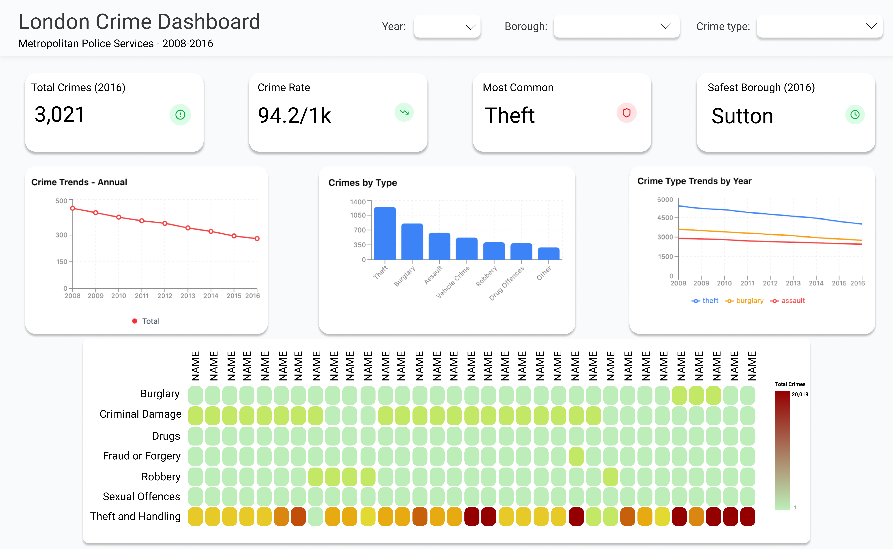

## Section 1: Motivation and Purpose

**Target Audience:** The dashboard serves government employees focused on London's public safety, prospective residents and relocators evaluating neighbourhoods, tourists planning stays, and legal professionals needing crime statistics for cases. We embody the role of a data analyst providing an accessible, evidence-based view of crime across London.

**Problem:** These audiences face a common challenge: crime data is fragmented, hard to interpret, and difficult to compare across boroughs and time. Government staff need quick, high-level summaries; residents and tourists want to identify safer areas; legal professionals need to validate or challenge claims about crime in specific boroughs.

**Solution:** The *Crime in London* dashboard centralises crime data in one interactive tool. Users can filter by year range and crime type, view key metrics (total crimes, crime rate, most common crime, average response time), and explore trends and patterns via charts. This helps users make informed decisions—whether choosing a borough to live in, selecting a hotel, or corroborating legal arguments.

---

## Section 2: Description of the Data

**Stats:** The London Crime dataset has approximately **1,048,574 rows** and **7 columns**. Each row represents a recorded crime incident aggregated at the LSOA (Lower Layer Super Output Area) level, with variables: `lsoa_code`, `borough`, `major_category`, `minor_category`, `value` (crime count), `year`, and `month`. Data spans from 2008 to 2016 across London's 32 boroughs.

**Relevance:** These variables map directly to user needs. `borough` supports borough-level comparisons for relocation and tourism; `major_category` and `minor_category` enable filtering by crime type (e.g., theft, burglary, violence); `year` and `month` support temporal analysis for trend detection and legal validation; and `value` provides counts for aggregations and rate calculations.

---

## Section 3: Research Questions & Usage Scenarios

Persona:

-   Jessica works at the London bureau investigation and wants a quick understanding of crimes over the past couple of years in the UK. With the use of this dashboard, Jessica can get an understanding o f key numbers in one glance and use the charts to get a better visualization of the number of crimes and trends over time.

Usage Need Scenario:

-   Employees working government jobs, specifically those concerned with London's safety could use this dashboard for a quick understanding of crimes rate over the past several years.

-   People moving to London can use this dashboard as a quick understanding of which borough has the highest or lowest crime rate, helping them decide which borough to consider for living.

-   Tourist are usually unfamiliar with London, so with the use of this dashboard, tourists can understand which neighborhood is safe to get a hotel or walk around at night.

User Stories:

-   My family and I are from the United States and we want to visit London for a summer trip. We have two kids under the age of five and we want to make sure our hotel is in a safe and quiet neighborhood. We want to make sure the location of our hotel has the lowest crime rate across all boroughs of London.

-   I have recently moved from Barcelona, Spain to London. I work at home and want to ensure the borough I move into has the lowest crime rate. This would ensure that I could safely stay home, and not worry about any solicitors and intruders, especially at night.

-   I work at a law firm, and our client was robbed of his possessions in Barnet, a borough in London. The defense argues that no crimes have occurred in that borough for the past two years. Using this dashboard, we can quickly validate or disprove this claim.

## Section 4: Exploratory Data Analysis

#### [Heat Map Visualization:]{.underline}

-   With the use of the heat map, users can easily hover over their desired borough and check the number or crime rates. This heat map is especially useful for users that are looking for a specific neighborhood/borough and the number of crimes, and the type of crime that took place there. The heat map could be a useful visualization for the lawyer, checking the for the median number of crimes in Barnet.

#### [Line Plot Visualization:]{.underline}

-   For users wanting to see the safest neighborhoods in London, they could use this line plot to get an understanding of the top 10 safest boroughs in London. With this line plot, the number of crimes over the past several years is shown, giving the user a quick and easy visualization of the potential borough they want to live in.

## Section 5: App Sketch & Description

- With our dashboard, our team ensured easy access to the most thorough information about crimes taking place in London. We made sure to highlight the most important information, including total crimes, crime rate per 1,000 people, most common type of crime, and the safest borough. With these quick numbers, users can easily get a general understanding of the crimes taking place in London and how they might impact them on a day-to-day basis. Furthermore, we included graphs that showcase these insights in a more comprehensive manner. As seen, we have created dummy graphs that showcase annual crimes, types of crimes and their frequency, along with crime trends over the past several years. We have also included a heat map that showcases each specific borough and the frequency of each crime in that borough. If users wish to select a specific year, crime type, or borough, we have included a global selector at the top of the dashboard that allows them to choose their desired specifications.

